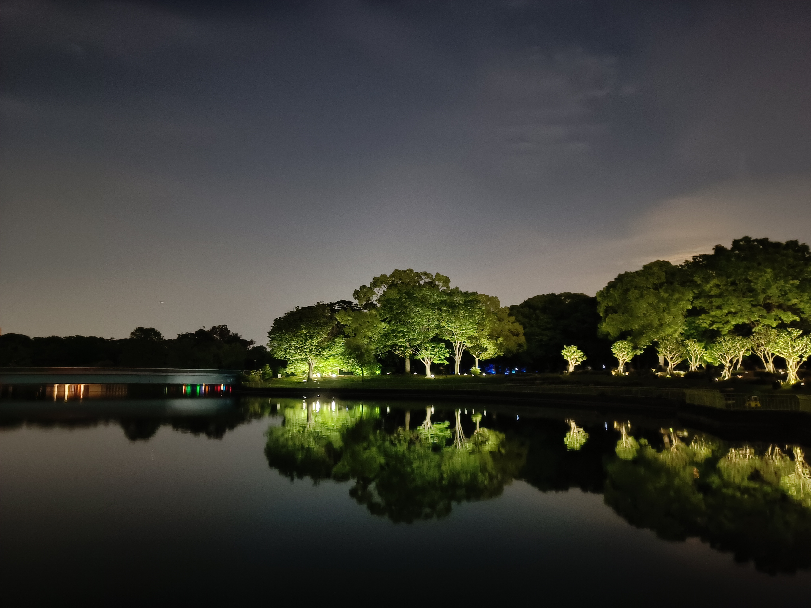

Heute sind wir im Nagai Park spazieren gegangen. Der Nagai Park ist ein großer Park, der neben Restaurants, einen botanischen Garten auch zwei Sportstadien, Ballspielplätze, Schwimmbäder, Tennisplätze, Trainingseinrichtungen und ein Sportzentrum für Behinderte hat. 
Wir haben sehr viele Menschen dort Walken, Joggen und Fahrrad fahren gesehen; der Park wird ausgiebig von den Anwohnern genutzt. 

Während unseres Spaziergangs kam uns ein älterer Herr entgegen und hat mir ein vierblättriges Kleeblatt geschenkt. 😍

Im Botanischen Garten, der sich im Nagai Park in Ōsaka befindet, kann man nach der Abenddämmerung das Kunstprojekt "Digitale Natur" von teamLab bewundern. Es erforscht, wie Natur zu Kunst werden kann. Im Garten wird mit digitaler Technologie Natur in Kunst verwandelt, ohne ihr dabei zu schaden (der Veranstalter weißt explizit darauf hin).

Die Kunstwerke in der Ausstellung werden von den im Garten lebenden Bäumen und Vögeln beeinflusst. Verschwindet die Tierwelt, verschwinden auch die Kunstwerke. Sie verändern sich interaktiv, beeinflusst durch Wind, Regen, sowie durch das Verhalten der Menschen und Tiere um sie herum. Dadurch wird die Umwelt, die die Kunstwerke umgibt, selbst zur Kunst.

Für die folgenden Videos am besten den Ton anschalten. 😊

Es gibt einen Kameliengarten voller Eiformen, die sich vom Tag zur Nacht verwandeln. Am Tag unter der Sonne spiegeln die Ovoide die Welt um sie herum. In der Nacht beginnen sie von selbst zu leuchten. Wenn ein Ei von einer Person angestupst wird, durch den Wind bewegt oder vom Regen getroffen wird, leuchtet es hell und erzeugt einen Ton, während es sich von selbst wieder erhebt. Die umgebenden Ovoide reagieren nacheinander, schwingen mit und geben den gleichen Ton und die gleiche Lichtfarbe ab.

Die riesigen Skulpturen in diesem Kunstwerk reagieren auf die Energie, die von vorbeifliegenden Vögeln durch ihre Flügelschläge (es entstehen Luftströme) übertragen wird; die Skulpturen stellen die Energie dar, die die Vögel an die Welt abgeben.
Wenn Vögel das Kunstwerk nicht umfliegen, lösen sich die Skulpturen in der Dunkelheit auf, als ob das Kunstwerk nicht existiere. Auf der Insel des Sees wurde eine für Vögel günstige Umgebung geschaffen; sie lockt Insekten an, von denen sich die Vögel ernähren können.

<iframe width="560" height="315" src="https://www.youtube.com/embed/5kUl74IG_5k?si=NkLhFOsP4cR-V3m0" title="YouTube video player" frameborder="0" allow="accelerometer; autoplay; clipboard-write; encrypted-media; gyroscope; picture-in-picture; web-share" referrerpolicy="strict-origin-when-cross-origin" allowfullscreen></iframe>

Die dicht nebeneinander stehenden Licht-Ovoide im Eukalyptuspark sind autonom, d.h. wenn ein Ovoid von Menschen, die sich hindurchbewegen, umgestoßen oder vom Wind berührt wird, erhebt es sich wieder, ändert die Farbe seines Lichts und gibt einen für diese Farbe spezifischen Ton ab. Die umgebenden Ovoide reagieren nacheinander, schwingen mit und geben den gleichen Ton und die gleiche Lichtfarbe ab. 

<iframe width="560" height="315" src="https://www.youtube.com/embed/j8BGBeBkNVs?si=Xjp0B6KNokgsaRzc" title="YouTube video player" frameborder="0" allow="accelerometer; autoplay; clipboard-write; encrypted-media; gyroscope; picture-in-picture; web-share" referrerpolicy="strict-origin-when-cross-origin" allowfullscreen></iframe>

Dieses Kunstwerk befindet sich am Eingang eines Waldes. Wenn die Menschen innerhalb des Waldes stehen bleiben, entsteht ein neuer Satz von grünen Linien, der sich über den Raum ausbreitet. Die Kombination der Linien lässt dei Bäume abgeflacht erscheinen.

<iframe width="560" height="315" src="https://www.youtube.com/embed/iU78yTES5Gc?si=kQ5U_yIjfOFVKbC8" title="YouTube video player" frameborder="0" allow="accelerometer; autoplay; clipboard-write; encrypted-media; gyroscope; picture-in-picture; web-share" referrerpolicy="strict-origin-when-cross-origin" allowfullscreen></iframe>

Hier sieht man eine fortlaufende und räumliche Kalligraphie, die in den Wald gezeichnet wird. Je schneller eine Person durch den Wald geht, desto schneller wird geschrieben.