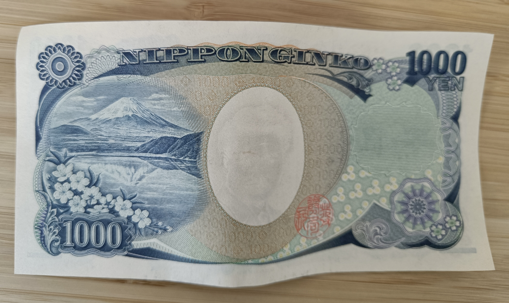

Gestern haben wir uns Yamanakako angeschaut, heute waren Motosuko und Shojiko, die beiden im Nordwesten liegenden Fuji-Seen, unser Ziel.

Der Motosuko-See mit Fuji-Aussicht ist auf dem 1.000-Yen-Schein abgebildet und er ist bis auf einige Campingplätze an den Ufern weitgehend unbebaut. Wir kamen mit dem Bus an der südöstlichen Seite an, sodass wir Fuji-san im Rücken hatten. Die Aussicht war trotzdem super schön. 😌 Wir haben lange überlegt, ob wir uns Fahrräder leihen, um zum 1.000-Yen-Schein-Aussichtspunkt zu fahren, uns aber dagegen entschieden (was wir später natürlich bereut haben 😒), weil es zum einen schon Nachmittag war und wir zum anderen bis dahin auf Grund der Wolken keine Sicht auf den Fuji hatten. Deswegen haben wir Eis gegessen und sind mit dem Bus zum Shojiko gefahren. 

Zwischen dem Motosuko (links) und dem Saiko (rechts) liegt Shijiko, der kleinste der fünf Fuji-Seen. Die drei Seen entstanden im 9. Jahrhundert, als Lavaströme vom Fuji einen großen prähistorischen See in drei kleinere teilten. Die Seen sind weiterhin durch unterirdische Wasserwege verbunden; sie erhalten weiterhin konstant den gleichen Wasserstand von 900 Metern über dem Meeresspiegel aufrecht.
Als wir am See ankamen, war es noch immer etwas wolkig, was aber dem wunderhübschen Fuji-Anblick nichts anhaben konnte. 😉

<iframe width="560" height="315" src="https://www.youtube.com/embed/BG8buuGLn5A?si=-B1cW4VksvPZQOsl" title="YouTube video player" frameborder="0" allow="accelerometer; autoplay; clipboard-write; encrypted-media; gyroscope; picture-in-picture; web-share" referrerpolicy="strict-origin-when-cross-origin" allowfullscreen></iframe>

Durch Eruptionen des Fuji sind mehrere Lava-Höhlen entstanden; auf einer Informationstafel war die Rede von rund 80 Höhlen um den Fuji herum. Wir haben zwei besucht - die Wind-Höhle und eine Eis-Höhle. Man geht einige Meter tief in die Erde; die Temperatur in der Höhlen ist um die 0°C und Wasser tropft von den Decken. Da es so kalt ist, bilden sich auch Eisblöcke. Die Höhlen waren früher natürliche Kühlschränke zur Lagerung von z.B. Baumsamen und Seidenraupeneier.

<iframe width="560" height="315" src="https://www.youtube.com/embed/tkL3ZwAYyIE?si=J4POjy7tTAY3Bg_9" title="YouTube video player" frameborder="0" allow="accelerometer; autoplay; clipboard-write; encrypted-media; gyroscope; picture-in-picture; web-share" referrerpolicy="strict-origin-when-cross-origin" allowfullscreen></iframe>

Es war auf jeden Fall ein spannender und erfrischender Abstieg in das "Höllenloch". ^^ Auch super interessant, wie 

Am Abend gab es dann noch Sashimi (roher Fisch, super lecker) und Udon mit Gemüse. 😋

<!-- # Wir konnten das Busticket nicht im Bus kaufen; Busfahrer wollte, dass wir es in der Station kaufen (2-Day-Ticket)
# Sashimi und Vegetable Udon am Abend gegessen in dem netten Restaurant mit hübschen Fuji Blick
# Am Shojiko wollte Akif gerne noch wandern, allerdings waaren wir für die Wanderroute nicht ausgerüstet; Akifs Schuhe waren nicht wandertauglich; es war ein relativ steiler Aufstieg und der Boden/die Erde war nicht so fest -->
